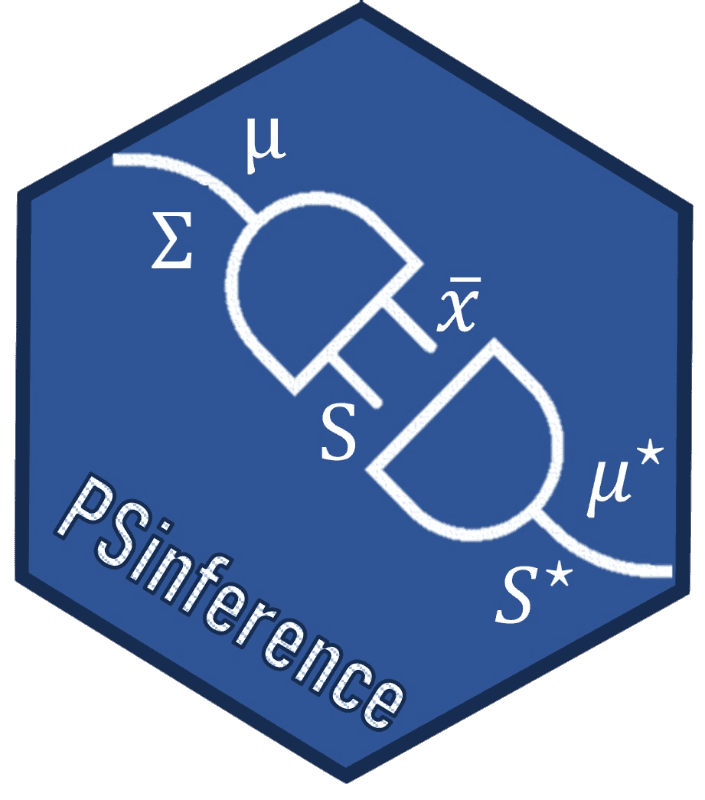

# PSinference 


[](https://github.com/ricardomourarpm/PSinference/actions/workflows/R-CMD-check.yaml)
[](https://cran.r-project.org/package=PSinference)
[](https://cran.r-project.org/package=PSinference)
[](https://cran.r-project.org/package=PSinference)
[](https://cran.r-project.org/package=PSinference)
[](https://www.gnu.org/licenses/gpl-3.0.en.html)

*PSinference* provides exact finite-sample inferential procedures for singly and *multiply* released plug-in sampling (PS) synthetic datasets under a multivariate normal model. The key insight is simple: an analyst who receives $M$ independent synthetic datasets $V_1, \ldots, V_M$ of size $n$ naturally treats all released data as a whole by stacking them into a single dataset of size $Mn$. This stacking is statistically justified — the $Mn$ rows are conditionally i.i.d. given the original data — and immediately extends the exact procedures of Klein et al. (2021) to arbitrary $M \geq 1$ via the substitution $n \to Mn$.

This work was supported by the Fundação para a Ciência e a Tecnologia (FCT, Portugal) under projects UID/00297/2025 and UID/PRR/00297/2025 (NOVAMath).

## Installation
You can install the **stable** version from
[CRAN](https://cran.r-project.org/package=PSinference).

```s
install.packages('PSinference', dependencies = TRUE)
```

You can install the **development** version from
[Github](https://github.com/ricardomourarpm/PSinference)

```s
# install.packages("remotes")
remotes::install_github("ricardomourarpm/PSinference")
```

## Quick Start

r
library(PSinference)
data(brittany_soil_ps)

# Generate 5 synthetic releases (stacked)
set.seed(42)
V <- simSynthData(brittany_soil_ps, M = 5)

# Sphericity test
res <- sphericity_test(V, M = 5)
print(res)
plot(res)

# Or use the unified wrapper
ps_test(V, M = 5, test = "independence", part = 4L)

# M = 1 recovers Klein et al. (2021)
V1 <- simSynthData(brittany_soil_ps)
ps_test(V1, M = 1, test = "sphericity")

## To cite package `PSinference` in publications use:
   Augusto V, Norouzirad M, Fonseca M, Moura R (202). _PSinference: Inference for Released Plug-in Sampling Synthetic Dataset_. R package version 1.0.0,
  <https://cran.r-project.org/package=PSinference>.

A BibTeX entry for LaTeX users is

  @Manual{PSinference,
    title = {PSinference: Inference for Released Plug-in Sampling Synthetic Dataset},
    author = {Vítor Augusto and Mina Norouzirad and Miguel Fonseca and Ricardo Moura},
    year = {2026},
    note = {R package version 1.0.0},
    url = {https://cran.r-project.org/package=PSinference}
  }

## References

Klein, M., Moura, R., and Sinha, B. (2021). Multivariate normal inference based on singly imputed synthetic data under plug-in sampling. Sankhya B, 83, 273--287.

## License

This package is free and open source software, licensed under GPL-3.
